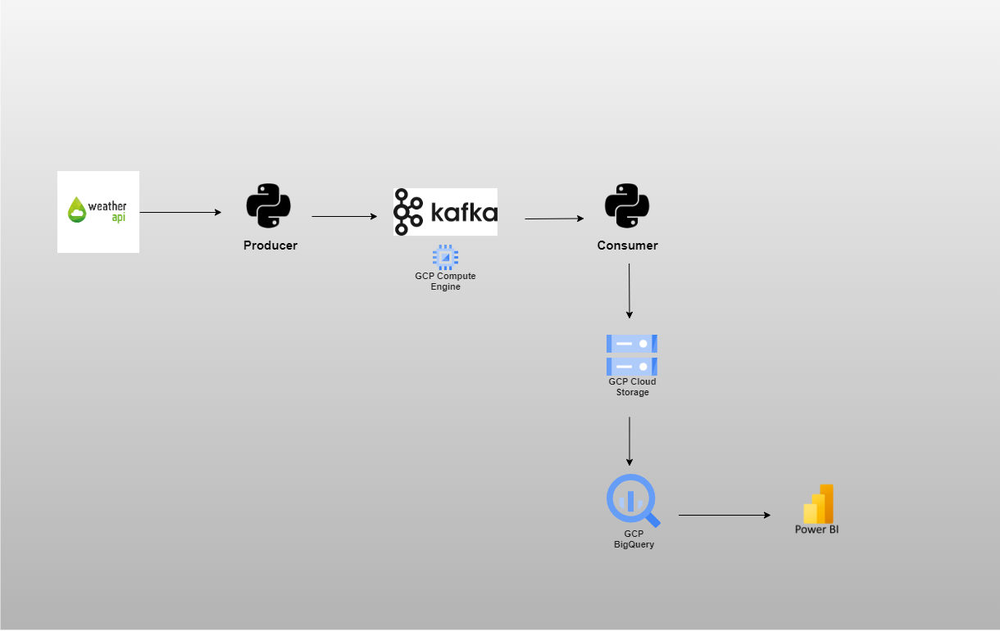
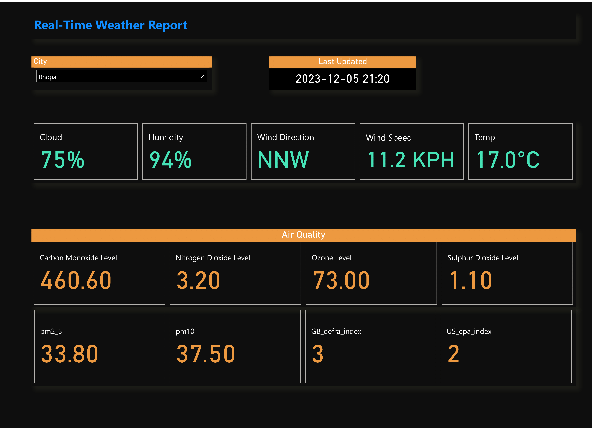

# Real-Time Weather Data Engineering with Kafka

Access my project files here - [Kafka-Weather-Data-Engineering-Project](https://github.com/Nitin0909/Kafka-Weather-Data-Engineering-Project)

## Introduction

This project showcases a real-time streaming pipeline utilizing Kafka to integrate a Weather API for live weather data collection. A producer program efficiently gathers this data and feeds it into a Kafka cluster for seamless ingestion. The consumer program, focusing on simplicity, stores each key-value pair as a JSON file directly into Google Cloud Storage (GCS). 
Utilizing BigQuery, an external table is established on the GCS bucket, facilitating structured querying and analysis of the stored JSON-formatted data. This repository provides insights and a guide into building an end-to-end real-time data engineering solution for weather data.

## Dataset

For this project, I'm utilizing the Weather API to collect real-time data for various cities. You can explore the API and find detailed information at the provided link below:

[Weather API](https://www.weatherapi.com/)

## Architecture

## Technology Used

### Programming Languages
- Python

### Google Cloud Platform
- Google Cloud Storage
- Google Cloud Compute Engine
- Google Cloud BigQuery
- Google Cloud VPC Network

### Other Tools
- Apache Kafka
- Data Visualization: Power BI

## Project Steps

1. **Data Collection with Weather API:**
   - Explored and identified a free Weather API for collecting real-time weather data.
   - Created a free account to obtain an access key for data collection.

2. **Setting Up Kafka Cluster:**
   - Utilized GCP Compute Engine's service to provision VM with the "Apache Kafka Server on Ubuntu Server 20.04" image, facilitating a streamlined installation process without the need for a separate Kafka setup.

3. **Setting Up Firewall Rule:**
   - Created an Ingress firewall rule to enable access to the Kafka server from the local machine.

4. **Changing Kafka "ADVERTISED_LISTENERS" Properties:**
   - Updated the "ADVERTISED_LISTENERS" properties in the Kafka server configuration (`config/server.properties`) to utilize the VM's public IP address for external connectivity.

5. **Producer Program Implementation:**
   - Created a producer program in Python to continuously fetch real-time weather data for specific cities.
   - Integrated a time interval (`time.sleep(5)`) to facilitate efficient data consumption by Kafka consumers.
   - Installed the `kafka-python` package to develop the Kafka program using Python.

6. **Consumer Program for GCS:**
   - Developed a consumer program to store key-value pairs directly as individual JSON files into Google Cloud Storage (GCS).
   - Generated unique JSON files, each labeled with timestamps and UUIDs for maintaining data uniqueness.
   - Created a dedicated Service Account with Google Cloud Storage (GCS) admin access, enabling the consumer program to write data seamlessly to the GCS path.

7. **Creating Bucket in GCS for Storage:**
   - Created a dedicated bucket within Google Cloud Storage (GCS) to store weather data in JSON format.

8. **Creating External Table in BigQuery:**
   - Set up a BigQuery external table connected to the GCS bucket, enabling seamless SQL querying and analytics on the JSON-formatted weather data stored within GCS.

9. **Power BI Dashboard Visualization:**
   - Created a user-friendly Power BI dashboard leveraging the external BigQuery table. This dashboard enables intuitive display and interaction with weather data from various cities.

Link to Dashboard -  [Power BI Dashboard](https://app.powerbi.com/groups/me/reports/cca1cc0f-eef9-4bdd-afb7-d6036eb86210/ReportSection?experience=power-bi)

